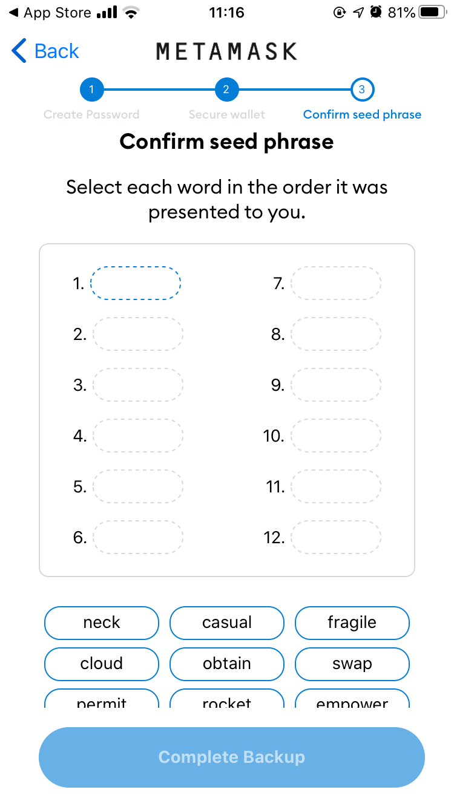
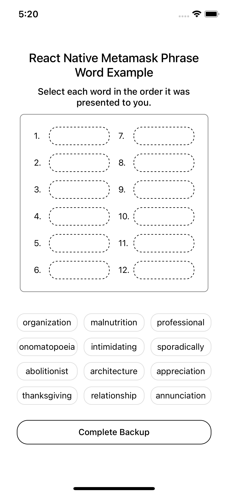
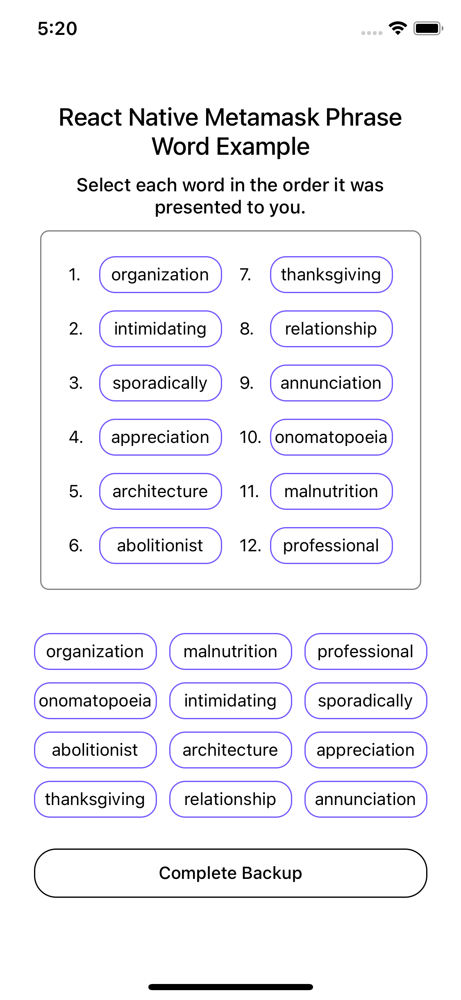
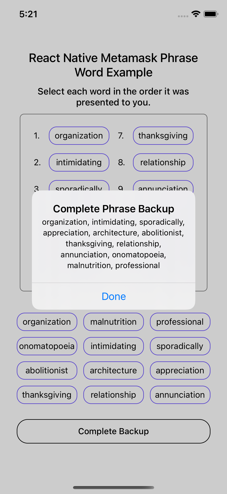

# react-native-metamask-phrase-backup

A simple and fully customizable React Native component that implements a metamask phrase backup.
* Fully customizable buttons and display selected value area

Metamask UI Example       
:-------------------------:


React Native Metamask Phrase Backup Example | React Native Metamask Phrase Backup Example | React Native Metamask Phrase Backup Example
:-------------------------:|:-------------------------:|:-------------------------:
 |  | 


## Installation

If using yarn:

```
yarn add react-native-metamask-phrase-backup
```

If using npm:

```
npm i react-native-metamask-phrase-backup
```

## Usage

```
import { PhraseBackup } from 'react-native-metamask-phrase-backup';
```

Simply place a `<PhraseBackup />` tag.

```
<View style={{flex: 1}}>
  <PhraseBackup data={data} onChange={onChangeSelectedValue}/>
</View>
```

### Cusomize Display Selected Area
Cusomize display selected area is fully customizable using the `isHaveDisplayValue, value` props.

```
const data = ['relationship', 'thanksgiving', 'professional', 'organization', 'sporadically', 'intimidating', 'abolitionist', 'onomatopoeia', 'appreciation', 'annunciation', 'malnutrition', 'architecture'];
const [displayArr, setDisplayArr] = useState(Array.from({ length: 12 }, (_, i) => i + 1));
const [value, setValue] = useState(null);
const handleSelect = (value) => {
  setDisplayArr(value);
}

const result = () => {
  Alert.alert(
    'Complete Phrase Backup',
    displayArr.toString().replaceAll(',', ', '),
    [
      { text: 'Done' },
    ],
  )
}

return <View style={styles.container}>
  <Text style={[styles.description, { fontSize: 20 }]}>React Native Metamask Phrase Word Example</Text>
  <Text style={styles.description}>Select each word in the order it was presented to you.</Text>
  <View style={{ flexDirection: 'row', justifyContent: 'center', alignItems: 'center', flexWrap: 'wrap', marginBottom: 30 }}>
    {displayArr.map((item, index) => (
      <View key={index} style={[styles.displayItemContainer]}>
        <Text style={{ marginRight: 3 }}>{index + 1}.</Text>
        <TouchableOpacity
          style={typeof item === 'string' ? styles.displaySelectedButton : styles.displayButton}
          onPress={() => typeof item === 'string' && setValue(item)}
        >
          <Text style={styles.buttonText}>{typeof item === 'string' && item}</Text>
        </TouchableOpacity>
      </View>
    ))}
  </View>
  <PhraseBackup isHaveDisplayValue={false} data={data} seeds={12} onChange={handleSelect} value={value}/>
  <TouchableOpacity style={{ width: 320, height: 40, borderWidth: 1, borderColor: '#000', borderRadius: 18, marginTop: 20, alignItems: 'center', justifyContent: 'center' }} onPress={result}>
    <Text style={{ fontWeight: '500' }}>Complete Backup</Text>
  </TouchableOpacity>
</View>;
```

## Documentation
### Changelog
#### Version 1.0.2

- Allow show/hide display selected area and you can customize that area.
- Update README.md

### Phrase Backup Component
| Name                      | Description                              | Default     | Type    |
|---------------------------|------------------------------------------|-------------|---------|
| data                      | The data of phrase backup string         | REQUIRED    | Array   |
| seeds                     | Total of phrase backup words             | 12          | number  |
| value                     | Just need value when you hide display selected area isHaveDisplayValue = false            | OPTIONAL          | string  |
| isHaveDisplayValue        | Show/Hide display seletected area, when you want to custom your display area        | TRUE          | boolean  |
| onChange                  | To get the selected string array         | null        | function |
| containerStyle            | The wrapper style of component           | null        | Object  |
| displaySelectedWrapperStyle | Style applied to the wrapper display seletected container  | null | Object  |
| displaySelectedStyle      | Style applied to the display seletected container  | null | Object  |
| displaySelectedItemRowStyle | Style applied to the display selected item row   | null | Object  |
| displaySelectedButtonStyle  | Style applied to the display selected button container  | null | Object  |
| displayButtonTextStyle    | Style applied to the display selected button text           | null | Object  |
| selectedButtonStyle       | Style applied to the selected button container     | null | Object  |
| buttonTextStyle           | Style applied to the selected button text          | null | Object  |

## Contributing
Pull requests are always welcome! Feel free to open a new GitHub issue for any changes that can be made.

## Author
Huy Pham

## License
[MIT](./LICENSE)